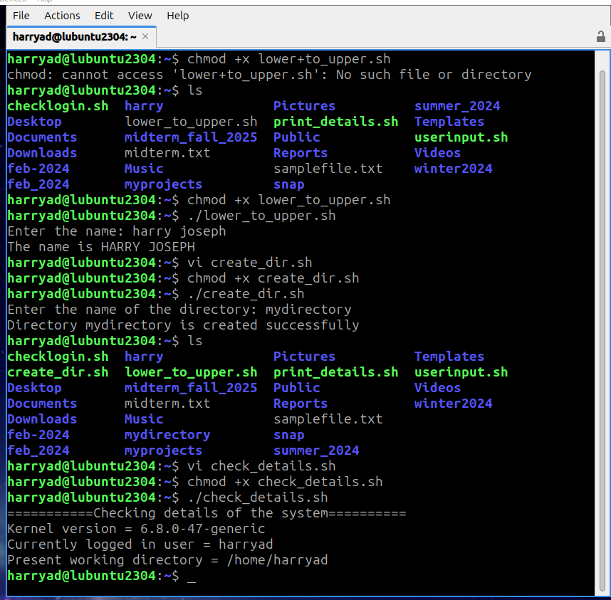

# Linux Scripting Lab 8

This repository contains several shell scripts for various tasks. Below is a brief synopsis of each script and a link to view the main screenshot.

## Scripts

### [lower_to_upper.sh](lower_to_upper.sh)
This script takes user input, converts it to uppercase, and displays the result.

### [check_details.sh](check_details.sh)
This script checks and displays various system details such as the kernel version, currently logged-in user, and the present working directory.

### [create_dir.sh](create_dir.sh)
This script prompts the user for a directory name, creates the directory, sets its permissions, and confirms the creation.

### Screenshot

 

[GitHub Harry Joseph](https://github.com/hjoseph777)
date: 2024-11-24